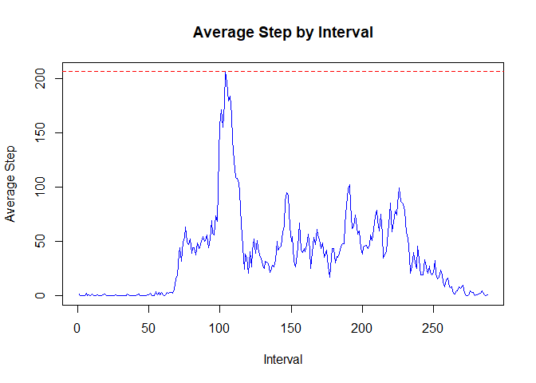

## Loading and preprocessing the data

```r
#Downloading the File:
dataurl <- "https://d396qusza40orc.cloudfront.net/repdata%2Fdata%2Factivity.zip"
if (!file.exists("activity.zip")) {
	download.file(dataurl, destfile = "activity.zip", method = "curl")
}

# Unzip data:
datafile <- "activity.csv"
if (!file.exists(datafile)) {
	unzip(zipfile = "activity.zip")
}

# Load data:
data <- read.csv(datafile, header = TRUE)
# To prevent scientific notation:
options(scipen = 100)

#The data will look like this:
dim(data)
```

```
## [1] 17568     3
```

```r
str(data)
```

```
## 'data.frame':	17568 obs. of  3 variables:
##  $ steps   : int  NA NA NA NA NA NA NA NA NA NA ...
##  $ date    : chr  "2012-10-01" "2012-10-01" "2012-10-01" "2012-10-01" ...
##  $ interval: int  0 5 10 15 20 25 30 35 40 45 ...
```

```r
head(data,5)
```

```
##   steps       date interval
## 1    NA 2012-10-01        0
## 2    NA 2012-10-01        5
## 3    NA 2012-10-01       10
## 4    NA 2012-10-01       15
## 5    NA 2012-10-01       20
```

```r
summary(data)
```

```
##      steps            date              interval     
##  Min.   :  0.00   Length:17568       Min.   :   0.0  
##  1st Qu.:  0.00   Class :character   1st Qu.: 588.8  
##  Median :  0.00   Mode  :character   Median :1177.5  
##  Mean   : 37.38                      Mean   :1177.5  
##  3rd Qu.: 12.00                      3rd Qu.:1766.2  
##  Max.   :806.00                      Max.   :2355.0  
##  NA's   :2304
```

```r
#For processing the data, here I will use dplyr package:
library(dplyr)
#If it is not install use install.packages('dplyr')
```


## What is mean total number of steps taken per day?

```r
#processing data for this question
steps_per_day <- select(data,steps,date,interval) %>% group_by(date) %>% summarise(total_steps=sum(steps,na.rm = TRUE))
mean_total_steps <- mean(steps_per_day$total_steps)
median_total_steps <- median(steps_per_day$total_steps)

#plot
hist(steps_per_day$total_steps, 
     main = "Histogram of total steps per day", 
     xlab = "Total steps per day", 
     ylab = "Frequency [number of days]", 
     breaks = 25,
     col = "lightgreen"
)

#Here, black line shows mean of total number of steps taken per day
abline(v = mean_total_steps, lwd = 1, lty = 2)
#Here, red line shows median of total number of steps taken per day
abline(v = median_total_steps, lwd = 1, lty = 2, col = "red")  
```

<!-- -->

#### The mean number of steps taken each day is 9354, the median number is 10395.  


## What is the average daily activity pattern?

```r
#processing data for this question
steps_by_interval <- select(data, steps, date, interval) %>% 
	group_by(interval) %>% 
	summarize(average_steps = mean(steps, na.rm = TRUE))

plot(steps_by_interval$average_steps,
     type='l',
     main = "Average Step by Interval", 
     ylab = "Average Step", 
     xlab = "Interval", 
     col = "blue"
)
max_average_steps <- max(steps_by_interval$average_steps)
max_average_steps_interval <- steps_by_interval[
	steps_by_interval$average_steps == max_average_steps,
]$interval
abline(v = max_average_steps_interval, lwd = 1, lty = 2, col = "red")
abline(h = max_average_steps, lwd = 1, lty = 2, col = "red")  
```

<!-- -->
  
835 is the 5-minute interval that, on average, contains the maximum number of 206 steps. 

  
## Imputing missing values
The total number of missing values in the dataset is 2304

```r
replaced_data <- data %>% mutate(replace_steps = ifelse(is.na(steps),steps_by_interval[2],steps))

head(replaced_data,1)
```

```
##   steps       date interval
## 1    NA 2012-10-01        0
##                                                                                                                                                                                                                                                                                                                                                                                                                                                                                                                                                                                                                                                                                                                                                                                                                                                                                                                                                                                                                                                                                                                                                                                                                                                                                                                                                                                                                                                                                                                                                                                                                                                                                                                                                                                                                                                                                                                                                                                                                                                                                                                                                                                                                                                                                                                                                                                                                                                                                                                                                                                                                                                                                                                                                                                                                                                                                                                                                                                                                                                                                                                                                                                                                                                                                                                                                                                                                                                                                                   replace_steps
## 1 1.7169811, 0.3396226, 0.1320755, 0.1509434, 0.0754717, 2.0943396, 0.5283019, 0.8679245, 0.0000000, 1.4716981, 0.3018868, 0.1320755, 0.3207547, 0.6792453, 0.1509434, 0.3396226, 0.0000000, 1.1132075, 1.8301887, 0.1698113, 0.1698113, 0.3773585, 0.2641509, 0.0000000, 0.0000000, 0.0000000, 1.1320755, 0.0000000, 0.0000000, 0.1320755, 0.0000000, 0.2264151, 0.0000000, 0.0000000, 1.5471698, 0.9433962, 0.0000000, 0.0000000, 0.0000000, 0.0000000, 0.2075472, 0.6226415, 1.6226415, 0.5849057, 0.4905660, 0.0754717, 0.0000000, 0.0000000, 1.1886792, 0.9433962, 2.5660377, 0.0000000, 0.3396226, 0.3584906, 4.1132075, 0.6603774, 3.4905660, 0.8301887, 3.1132075, 1.1132075, 0.0000000, 1.5660377, 3.0000000, 2.2452830, 3.3207547, 2.9622642, 2.0943396, 6.0566038, 16.0188679, 18.3396226, 39.4528302, 44.4905660, 31.4905660, 49.2641509, 53.7735849, 63.4528302, 49.9622642, 47.0754717, 52.1509434, 39.3396226, 44.0188679, 44.1698113, 37.3584906, 49.0377358, 43.8113208, 44.3773585, 50.5094340, 54.5094340, 49.9245283, 50.9811321, 55.6792453, 44.3207547, 52.2641509, 69.5471698, 57.8490566, 56.1509434, 73.3773585, 68.2075472, 129.4339623, 157.5283019, 171.1509434, 155.3962264, 177.3018868, 206.1698113, 195.9245283, 179.5660377, 183.3962264, 167.0188679, 143.4528302, 124.0377358, 109.1132075, 108.1132075, 103.7169811, 95.9622642, 66.2075472, 45.2264151, 24.7924528, 38.7547170, 34.9811321, 21.0566038, 40.5660377, 26.9811321, 42.4150943, 52.6603774, 38.9245283, 50.7924528, 44.2830189, 37.4150943, 34.6981132, 28.3396226, 25.0943396, 31.9433962, 31.3584906, 29.6792453, 21.3207547, 25.5471698, 28.3773585, 26.4716981, 33.4339623, 49.9811321, 42.0377358, 44.6037736, 46.0377358, 59.1886792, 63.8679245, 87.6981132, 94.8490566, 92.7735849, 63.3962264, 50.1698113, 54.4716981, 32.4150943, 26.5283019, 37.7358491, 45.0566038, 67.2830189, 42.3396226, 39.8867925, 43.2641509, 40.9811321, 46.2452830, 56.4339623, 42.7547170, 25.1320755, 39.9622642, 53.5471698, 47.3207547, 60.8113208, 55.7547170, 51.9622642, 43.5849057, 48.6981132, 35.4716981, 37.5471698, 41.8490566, 27.5094340, 17.1132075, 26.0754717, 43.6226415, 43.7735849, 30.0188679, 36.0754717, 35.4905660, 38.8490566, 45.9622642, 47.7547170, 48.1320755, 65.3207547, 82.9056604, 98.6603774, 102.1132075, 83.9622642, 62.1320755, 64.1320755, 74.5471698, 63.1698113, 56.9056604, 59.7735849, 43.8679245, 38.5660377, 44.6603774, 45.4528302, 46.2075472, 43.6792453, 46.6226415, 56.3018868, 50.7169811, 61.2264151, 72.7169811, 78.9433962, 68.9433962, 59.6603774, 75.0943396, 56.5094340, 34.7735849, 37.4528302, 40.6792453, 58.0188679, 74.6981132, 85.3207547, 59.2641509, 67.7735849, 77.6981132, 74.2452830, 85.3396226, 99.4528302, 86.5849057, 85.6037736, 84.8679245, 77.8301887, 58.0377358, 53.3584906, 36.3207547, 20.7169811, 27.3962264, 40.0188679, 30.2075472, 25.5471698, 45.6603774, 33.5283019, 19.6226415, 19.0188679, 19.3396226, 33.3396226, 26.8113208, 21.1698113, 27.3018868, 21.3396226, 19.5471698, 21.3207547, 32.3018868, 20.1509434, 15.9433962, 17.2264151, 23.4528302, 19.2452830, 12.4528302, 8.0188679, 14.6603774, 16.3018868, 8.6792453, 7.7924528, 8.1320755, 2.6226415, 1.4528302, 3.6792453, 4.8113208, 8.5094340, 7.0754717, 8.6981132, 9.7547170, 2.2075472, 0.3207547, 0.1132075, 1.6037736, 4.6037736, 3.3018868, 2.8490566, 0.0000000, 0.8301887, 0.9622642, 1.5849057, 2.6037736, 4.6981132, 3.3018868, 0.6415094, 0.2264151, 1.0754717
```

```r
# Could not figure out how to take 1 value for a particular row attaching whole vector

#Thought of replacing na values with mean
steps_mm <- select(data,steps,date,interval) %>% group_by(date) %>% summarise(mean_steps=mean(steps,na.rm = TRUE))
steps_mm$mean_steps[is.nan(steps_mm$mean_steps)] <- 0

updated_data <- data %>% mutate(update_steps = ifelse(is.na(steps),steps_mm[2],steps))

head(updated_data,1)
```

```
##   steps       date interval
## 1    NA 2012-10-01        0
##                                                                                                                                                                                                                                                                                                                                                                                                                                                                                                                                                                                                                                                                                                                                      update_steps
## 1 0.0000000, 0.4375000, 39.4166667, 42.0694444, 46.1597222, 53.5416667, 38.2465278, 0.0000000, 44.4826389, 34.3750000, 35.7777778, 60.3541667, 43.1458333, 52.4236111, 35.2048611, 52.3750000, 46.7083333, 34.9166667, 41.0729167, 36.0937500, 30.6284722, 46.7361111, 30.9652778, 29.0104167, 8.6527778, 23.5347222, 35.1354167, 39.7847222, 17.4236111, 34.0937500, 53.5208333, 0.0000000, 36.8055556, 36.7048611, 0.0000000, 36.2465278, 28.9375000, 44.7326389, 11.1770833, 0.0000000, 0.0000000, 43.7777778, 37.3784722, 25.4722222, 0.0000000, 0.1423611, 18.8923611, 49.7881944, 52.4652778, 30.6979167, 15.5277778, 44.3993056, 70.9270833, 73.5902778, 50.2708333, 41.0902778, 38.7569444, 47.3819444, 35.3576389, 24.4687500, 0.0000000
```

```r
#Getting same as above output

#trying this
updated_activity <- data
for(r in 1:nrow(updated_activity)) {
	if (is.na(updated_activity$steps[r])) {
		i <- updated_activity$interval[r];
		avg <- steps_by_interval[steps_by_interval$interval==i,]$average_steps
		
		updated_activity$steps[r] <- avg
	}
}

head(updated_activity[which(
	updated_activity$date %in% c("2012-10-01", "2012-10-08", "2012-11-01", "2012-11-04", "2012-11-09", "2012-11-10") & 
	updated_activity$interval %in% c(600,1000,2000)),], n = 30)
```

```
##          steps       date interval
## 73    31.49057 2012-10-01      600
## 121   40.56604 2012-10-01     1000
## 241   19.62264 2012-10-01     2000
## 2089  31.49057 2012-10-08      600
## 2137  40.56604 2012-10-08     1000
## 2257  19.62264 2012-10-08     2000
## 9001  31.49057 2012-11-01      600
## 9049  40.56604 2012-11-01     1000
## 9169  19.62264 2012-11-01     2000
## 9865  31.49057 2012-11-04      600
## 9913  40.56604 2012-11-04     1000
## 10033 19.62264 2012-11-04     2000
## 11305 31.49057 2012-11-09      600
## 11353 40.56604 2012-11-09     1000
## 11473 19.62264 2012-11-09     2000
## 11593 31.49057 2012-11-10      600
## 11641 40.56604 2012-11-10     1000
## 11761 19.62264 2012-11-10     2000
```

```r
updated_steps_by_date <- select(updated_activity, steps, date, interval) %>% 
    group_by(date) %>% 
    summarize(total_steps = sum(steps, na.rm = TRUE))

hist(updated_steps_by_date$total_steps, 
	main = "Histogram of total steps per day,\nreplacing NAs with average steps for given interval", 
	xlab = "Total steps per day", 
	ylab = "Frequency [number of days]", 
	breaks = 20,
	border = "cadetblue4",
	col = "cadetblue3"
)
updated_mean_total_steps <- mean(updated_steps_by_date$total_steps)
updated_median_total_steps <- median(updated_steps_by_date$total_steps)
abline(v = updated_mean_total_steps, lwd = 1, lty = 2, col = "red")
abline(v = updated_median_total_steps, lwd = 1, lty = 2, col = "red")
```

<!-- -->
  
The mean number of steps taken each day is now 10766 
(compared to 9354 with NAs), and the median number 
is 10766 now (compared to 10395 with NAs). 


## Are there differences in activity patterns between weekdays and weekends?

```r
activity_with_weekday <- mutate(updated_activity, 
	weekday = weekdays(as.Date(updated_activity$date)),
	weekday_is = as.factor(ifelse(weekday=="Saturday" | weekday=="Sunday", "weekend", "weekday"))
)
# Sample of the extended data
head(select(activity_with_weekday, date, weekday, weekday_is) %>% distinct(date), n = 20)
```

```
##          date
## 1  2012-10-01
## 2  2012-10-02
## 3  2012-10-03
## 4  2012-10-04
## 5  2012-10-05
## 6  2012-10-06
## 7  2012-10-07
## 8  2012-10-08
## 9  2012-10-09
## 10 2012-10-10
## 11 2012-10-11
## 12 2012-10-12
## 13 2012-10-13
## 14 2012-10-14
## 15 2012-10-15
## 16 2012-10-16
## 17 2012-10-17
## 18 2012-10-18
## 19 2012-10-19
## 20 2012-10-20
```

```r
library(lattice) 
# Get average number of steps per weekday/weekend and interval
summary <- select(activity_with_weekday, steps, date, interval, weekday_is) %>% 
    group_by(weekday_is, interval) %>% 
    summarize(average_steps = mean(steps, na.rm = TRUE))
```

```
## `summarise()` regrouping output by 'weekday_is' (override with `.groups` argument)
```

```r
xyplot(average_steps ~ interval | weekday_is, data = summary, layout = c(1,2), type = "l",
	main = "Average steps by 5-minute interval",
	xlab = "Interval",
	ylab = "Average number of steps",
	col = "cadetblue4"
)
```

<!-- -->

Yes, there is a difference in activity patterns between weekdays and weekends.
It looks like the activities start a little later and more gradually on the weekends. The step volume is also a bit higher throughout the day.
On weekdays the step volume appears to be higher and increase quicker (more steeply) in the mornings, but remains a little lower throughout the day.


```r
# Clean up
rm(list=ls(all=TRUE)) 
```
